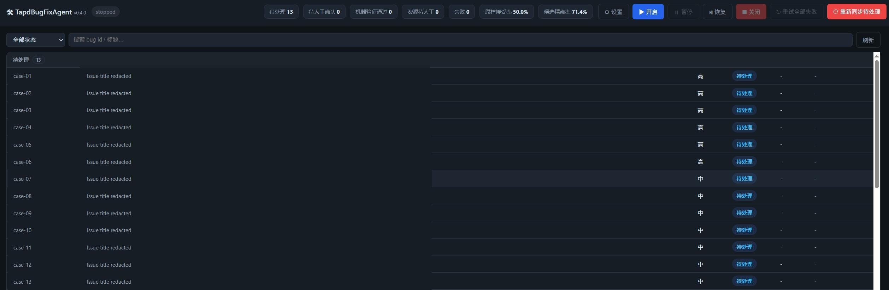

# TapdBugFixAgent

自动从 Tapd 拉取分配给你的 Bug，按优先级执行 **准入 → 只读调查 → 最小修复 → 机器验证 → 独立评审**，
产出 **Perforce pending changelist**（描述自动生成，首行带 `【b<短号>】` 可过 swarm 校验），并回写 Tapd 评论。
配套 **Web 管理台** 实时监控与控制全流程。



**安全约定**：永不 `p4 submit`、永不修改 Tapd 单子状态——代码停在 pending changelist，由你 review/submit 后自行关单。
涉及 prefab / 表格等二进制资源的改动不强改：Agent 会列入「需人工处理资源」记录在案。

纯 TypeScript（Node ≥ 20），SQLite 状态库，无 Python 依赖。

---

## 目录

- [快速开始](#快速开始)
- [前置条件](#前置条件)
- [配置](#配置)
- [运行](#运行)
- [Web 管理台](#web-管理台)
- [工作原理](#工作原理)
- [常见问题](#常见问题)

## 快速开始

```bash
git clone <本仓库> && cd TapdBugFixAgent

# 1. 装依赖（Node ≥ 20）
npm install

# 2. 装 Pi 编码 Agent（仅使用 Pi 后端时需要）
npm install -g @earendil-works/pi-coding-agent

# 3. 生成配置
cp config.example.yaml config.yaml
cp .env.example .env

# 4. 编辑 config.yaml（4 处必填，见下节）和 .env（Tapd 令牌）

# 5. 只读验证：能拉到"分配给我的" bug 列表即可启动
npm run dev -- list

# 6. 启动 Web 管理台
npm start -- serve
# 打开 http://127.0.0.1:8080/?token=<你的WEB_TOKEN>，点「▶ 开启」
```

## 前置条件

| 依赖 | 说明 |
|---|---|
| Node.js ≥ 20 | 运行本体与 Tapd MCP（stdio 模式经 `npx` 跑官方包） |
| 编码 Agent | Pi：全局安装 `@earendil-works/pi-coding-agent`；Codex：项目依赖已包含官方 `@openai/codex-sdk` |
| p4 命令行 | 在 PATH 中；为 Agent 建一个**专用 client workspace**（如 `tapd-agent_<你>`），别与日常开发共用 |
| Tapd 凭据 | **个人访问令牌**（推荐，个人设置 → 个人访问令牌 创建）或 API 账号 |

pi 鉴权（任选其一）：
- 环境变量 `ANTHROPIC_API_KEY`（或 `ANTHROPIC_OAUTH_TOKEN`）；
- 或先手动跑一次 `pi /login` 做 OAuth 登录；
- 或走公司网关/中转：在 `config.yaml` 配 `pi.provider` 段（base_url + api_key_env），工具会在每次
  spawn 前自动合并写入 `~/.pi/agent/models.json`（密钥引用环境变量名，不落盘）。

Codex 鉴权：使用本机 Codex 登录状态，或在 `.env` 设置 `OPENAI_API_KEY`。服务不会把 API Key 返回给管理台，
`codex.api_key_env` 只配置环境变量名。

## 配置

### config.yaml 必填 4 处

```yaml
workspaces:
  - workspace_id: "52729922"        # ① Tapd 项目 id（bug 链接 bug_<workspace_id>... 里就有）
    owner: "你的Tapd登录名"           # ② current_owner 过滤"分配给我的"
    repos:
      - name: "P4_Project_Name"
        path: 'D:\p4\client'        # ③ 本地 p4 workspace root（专用 client）
        verify_cmds:                # 按顺序执行；任一失败即停止
          - "npm run typecheck"
          - "npm test -- --runInBand"

p4:
  port: p4.example.com:1666         # ④ p4 服务器
  client: tapd-agent_you            #    专用 client 名
  user: you
  password: "..."
```

其余（Agent 后端、Pi/Codex 参数、Web token、Tapd 后端选择）见 `config.example.yaml` 内注释。默认仍使用 Pi；
切换 Codex 只需设置：

```yaml
agent:
  backend: codex

codex:
  model: ""                 # 空值沿用本机 Codex 默认模型
  reasoning_effort: high

review:
  backend: ""               # 跟随主后端；也可设 pi/codex 做交叉评审
```

### .env

```ini
TAPD_ACCESS_TOKEN=...      # Tapd 个人设置 → 个人访问令牌
WEB_TOKEN=...              # 管理台鉴权（URL 带 ?token= 或页面弹窗输入）
# P4PORT/P4CLIENT/P4USER/P4PASSWD  # 也可放这里，优先级高于 config.yaml
```

> 改连接配置不必动文件：管理台顶部 **⚙ 设置** 可在线选择 Pi/Codex、编辑 Agent 与 p4/tapd 连接项，保存写 `overrides.yaml`（优先级最高）。

## 运行

```bash
npm run dev -- list            # 只读：列出分配给我的 bug（按优先级）
npm run dev -- mcp-tools       # 调试：打印 Tapd MCP 发现的工具清单
npm run dev -- run --once      # 无界面：处理最高优先级的 1 个 bug（首次接入先跑这个试试）
npm run dev -- serve           # Web 管理台 + 工作线程（日常用法）

# 生产（构建后常驻）
npm run build && npm start
```

CLI 通用选项：`--config <path>`、`--db <path>`、`--host` / `--port`（serve）。

单个 bug 的处理流程：拉取队列（≤1 次/分钟缓存）→ 自动修复准入评分 → `p4 sync` →
只读调查 Agent（通过 `--tools read,grep,find,ls` 强制禁止写入）→ 修复 Agent 最小修改 →
P4 范围门禁 → `verify_cmds` 机器验证 → 独立只读 Reviewer → Reviewer finding 定向修正/复审 →
生成 pending changelist → Tapd 评论（不改状态）。失败按 `max_attempts` 自动重试并携带测试、文件和评审证据。

整体执行架构参考 OpenAI 的 [Codex as a platform](https://developers.openai.com/blog/codex-as-a-platform) 与
[开源 Codex harness](https://github.com/openai/codex)：由宿主应用提供业务上下文、边界、状态与审批，Agent harness
负责持续任务、工具调用、进度和失败处理。Prompt 设计同时参考 Codex 官方公开的
[prompting/workflows](https://developers.openai.com/codex/workflows) 与 [code review](https://developers.openai.com/codex/code-review) 原则；
不复制或依赖任何产品的隐藏 system prompt。三个阶段使用不同的执行契约：

- **调查**：先读仓库规则和相关测试，区分观察事实、推断和未验证假设，比较候选根因并给出排除依据；证据不足则停止。
- **实施**：编辑前复核调查结论，只做最小完整补丁，按“专项复现 → 最小相关测试 → 配置验证”执行并如实报告结果。
- **评审**：只读检查根因覆盖、范围、回归测试和关键错误/生命周期路径；只报告有证据、失败场景和明确修法的 actionable findings。

### 准确率门禁

- **结构化 Bug 上下文**：从 TAPD 原始字段整理复现步骤、预期/实际结果、环境、日志、评论和附件。
- **自动修复准入**：描述过短、缺少复现信号时进入 `needs_info`；资源类进入 `manual_only`；支付、账号、
  存档、协议等高风险项进入 `manual_review`。
- **严格验证**：未配置 `verify_cmds` 时只能生成 `candidate`，不会标记为“已验证”。
- **范围限制**：默认最多 8 个文件、500 行 diff，超限转失败/人工分析，避免无关大改。
- **计划白名单**：实际 P4 改动必须属于只读调查阶段声明的 `planned_files`，计划外文件会拒绝候选。
- **工作区隔离**：default changelist 中若有无法归属当前 Bug 的遗留文件，或 `p4 reconcile -n`
  检出未登记的本地改动，任务进入 `blocked_workspace`，不调用 Agent、不消耗重试次数，也绝不把遗留改动混入当前补丁。
- **独立评审**：Reviewer 强制只读；high/medium finding 会交回 Fixer，修正后重新验证和复审。
- **真实结果回流**：人工可记录原样接受、修改后接受、具体拒绝原因和 reopen，管理台展示真实准确率。

## Web 管理台


- **控制**：开启 / 暂停 / 恢复 / 关闭；标题旁显示运行版本（改代码后重启才会变，用于辨认旧进程）
- **列表**：按状态分组（处理中置顶），显示优先级 / changelist / 尝试次数；`⚠不在Tapd列表` 标记本地有记录但
  已不在"分配给我"列表的 bug（可重试，Tapd 已删除的会自动跳过并留痕）
- **详情抽屉**：Agent 实时进度（终端形式）、生成的 changelist 描述、修改文件、需人工资源、失败原因、
  自动重试记录、只读调查结论、机器验证、Reviewer findings、操作日志
- **人工结论**：在候选详情记录原样接受 / 修改后接受 / 根因错误 / 定位错误 / 回归 / 过度修改 /
  未解决 / reopen；不会自动 submit，也不会修改 TAPD 状态
- **质量指标**：顶部显示原样接受率和候选精确率；`GET /api/quality/metrics` 可供监控系统采集
- **批量操作**：
  - **↻ 重试全部失败**：所有失败任务重置为待处理并入队
  - **⟳ 清除并重新同步**（仅非运行状态可用）：清空本地任务状态和事件，从 Tapd 强拉最新列表重置为待处理。
    人工反馈与质量指标会保留；p4 上已生成的 pending changelist 不受影响，但 Tapd 上仍是 new 的旧单会被重新处理
- **单条操作**：重试 / 跳过（正在处理的重试/跳过会先中断当前尝试）
- **⚙ 设置**：在线编辑连接配置（写 overrides.yaml）
- token 错误会弹输入框让你当场修正并记住，不再是死胡同

底部 Agent 输出区跟随当前处理中的 bug（SSE 每 2 秒推送），分割线可拖拽调高度。

## 工作原理

```
Tapd ──MCP(个人令牌)──> Orchestrator(worker) ──adapter──> Pi subprocess
Tapd ──REST(API账号)──>       │        │          └──────> OpenAI Codex SDK
      ^                       │        └── reconcile/edit/add ─> Perforce workspace
      └── 评论回写(不改状态)   │
                              Web 管理台 (Express + SSE)
```

**新状态机**：

```text
pending → in_progress
  ├─ needs_info / manual_only / manual_review
  ├─ blocked_workspace         # default changelist 有无法归属的遗留文件，清理后人工重试
  ├─ candidate                 # 有补丁但未配置机器验证
  ├─ candidate_partial         # 候选代码 + 人工资源项
  ├─ verified                  # 机器验证通过，未启用独立评审
  └─ review_pending            # 机器验证和独立评审通过
       ├─ accepted
       ├─ accepted_modified
       ├─ rejected
       └─ reopened
```

失败未耗尽重试回 `pending`；Tapd 上已删除的单自动转 `skipped` 留痕。
开发阶段不维护旧数据库迁移。新版默认使用 `tapd_agent_v2.db`；旧 `tapd_agent.db` 原样保留，
不读取也不自动转换。若显式传入旧 schema 数据库，启动会提示改用新库。

**P4 安全**：Agent 只允许 `p4 edit / add / delete`（submit / revert / sync / change 写入 prompt 禁止）；
工具侧只收集 **default changelist** 的文件生成 pending，绝不动其它编号 changelist；
`p4 reconcile -n` 兜底防改动丢失。

**团队 skill**：Pi 后端自动挂载仓库下的 `.agents/skills` / `.agent/skills`（存在才挂）——
同事放在版本库里的 skill 修复 Agent 也能用。目录结构 `<名字>/SKILL.md`（frontmatter 需
name + description，文件必须无 BOM）。可用 `pi.skill_dirs` 覆盖。

**修复守则**：`prompts/defensive-patterns.md` 启动时读取并注入实施 Prompt。它按“检查点 / 必须保持的不变量 /
常见坏修复”整理根因、异步竞争、取消与清理、重试幂等、状态机、缓存、协议、边界输入、验证诚实性和 diff 范围；
只要求 Agent 应用与当前 Bug 有关的条目。删文件即停用。

## 历史 Bug 离线评测

用固定 JSONL 历史集比较不同模型或 Prompt，不接触真实 P4 workspace：

```bash
npm run dev -- eval \
  --dataset eval/cases.jsonl \
  --result deepseek-v4=eval/results-deepseek-v4.jsonl \
  --result reviewer-v2=eval/results-reviewer-v2.jsonl
```

数据集每行：

```json
{"bug_id":"b1","category":"async_state","expected_files":["src/Settings.ts"],"forbidden_files":["src/Auth.ts"],"requires_verification":true}
```

结果每行：

```json
{"bug_id":"b1","changed_files":["src/Settings.ts"],"verification_ok":true,"review_approved":true,"human_outcome":"accepted_unchanged","reopened":false}
```

输出覆盖率、有效修复率、验证通过率、范围精确率、评审通过率、原样接受率和加权综合分。

**changelist 描述**：首行 `【b<短号>】<标题>`（= Tapd「复制Bug单信息」按钮的文本，可过 swarm 校验；
短号由完整 id 推导），后附单号链接 / 修复说明 / 修改文件 / 需人工资源 / 验证结果。

## 常见问题

**点重试没反应？** 早期版本列表只显示 Tapd 当前列表，已不在列表的 bug 重试后无人处理——已修复（本地记录可见可处理）。
若整页无响应看浏览器控制台；token 失效会弹输入框。

**列表里的 bug 不在了还显示？** 标 `⚠不在Tapd列表` 的是本地历史记录（可重试）。Tapd 上确认已删除的单，
worker 轮询时自动转跳过并写明原因。

**怎么确认跑的是新代码？** 标题旁版本号（如 v0.3.2）。改完代码记得重启进程——旧进程会一直占着端口。

**修复好的单子又出现在队列？** 工具不改 Tapd 状态，所以单子状态仍是 new；若用「清除并重新同步」，
这些单会重新处理。已人工关闭（resolved 等）的单不会。

**开发**：`npm test`（vitest，162 个用例）；源码在 `src/`，构建产物 `dist/`（含 `prompts/`）。

## 风险提示

自动修真实 Bug 有风险（语义误判、误改）。保持 `review` 模式：代码停在 pending changelist，
人工 review 后 submit；确认无误再去 Tapd 关单。
